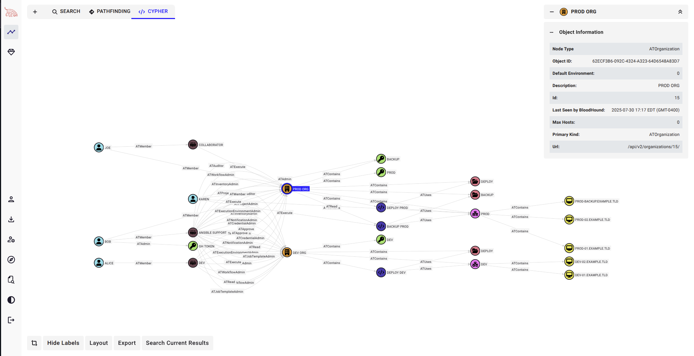
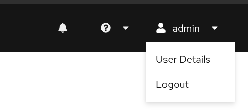
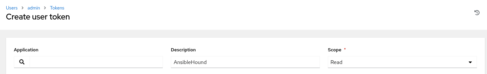
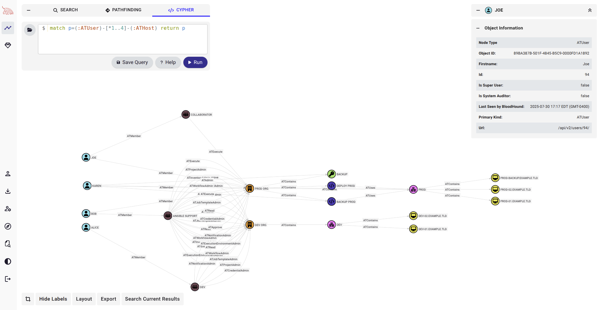

# AnsibleHound



## Overview

**AnsibleHound** is a BloodHound OpenGraph collector for **Ansible WorX** and **Ansible Tower**. The collector is designed to map the structure and permission of your organization into a navigable attack‑path graph.

Developped by [@Ramoreik](https://github.com/Ramoreik) and [@s_lck](https://github.com/s-lck).

## Collector Setup & Usage

### Creating a token

To obtain a valid token for **Ansible WorX** or **Ansible Tower**, you can navigate to the **User Details** of your current user.



Then the **tokens** tab.


Finally, create a token and give it **Read** permissions.



### Building the tool

```bash
go build . -o build/collector
```

### Running the Collection

You can run the collector by providing it a **target** and a **token**. It will enumerate what it can give the user's access.

```bash
./collector -u '<ansible-url>' -t '<token>'

# Example
./collector -u 'http://localhost:8080/' -t '56KOmh...'
```

> Note : If you have multiple instances of Ansible you need to run the collector against each of them

### Load Icons

A script is provided to import the icon for the custom nodes used by AnsibleHound.
You have to provide it the `bloodhound-url` and `jwt-token`.

```bash
python3 ./scripts/import-icons.py <bloodhound-url> <jwt-token>

# Example
python3 ./scripts/import-icons.py 'http://localhost:8080' 'ey[...]'
```

### Samples

If you don't have any Ansible WorX or Tower environment, you can just drop `./samples/example.json` on BHCE to enjoy the graph.

## Schema



### Nodes

Nodes correspond to each object type.

| Node              | Description                                                                                                           | Icon          | Color   |
| ----------------- | --------------------------------------------------------------------------------------------------------------------- | ------------- | ------- |
| ATAnsibleInstance | Complete installation of Ansible                                                                                      | sitemap       | #F59C36 |
| ATOrganization    | Logical collection of users, teams, projects, and inventories. It is the highest-level object in the object hierarchy | building      | #F59C36 |
| ATInventory       | Collection of hosts and groups                                                                                        | network-wired | #FF78F2 |
| ATUser            | An individual user account                                                                                            | user          | #7ADEE9 |
| ATJob             | Instance launching a playbook against an inventory of hosts                                                           | gears         | #7CAAFF |
| ATJobTemplate     | Combines an Ansible playbook from a project and the settings required to launch it                                    | code          | #493EB0 |
| ATProject         | Logical collection of Ansible playbooks                                                                               | folder-open   | #EC7589 |
| ATCredential      | Authenticate the user to launch playbooks (passwords - SSH keys) against inventory hosts                              | key           | #94E16A |
| ATCredentialType      |                               | key           | #94E16A | Type of the Credential and information about this type.
| ATHost            | These are the target devices (servers, network appliances or any computer) you aim to manage                          | desktop       | #E9E350 |
| ATTeam            | A group of users                                                                                                      | people-group  | #724752 |

> **Note** : This is a work in progress

### Edges

All the edges are prefixed by `AT` to make it distinct from other collectors edges.

| Edge Type    | Source              | Target                                                                                       |
| ------------ | ------------------- | -------------------------------------------------------------------------------------------- |
| `ATContains` | `ATAnsibleInstance` | `ATOrganization`                                                                             |
| `ATContains` | `ATOrganization`    | `ATInventory`                                                                                |
| `ATContains` | `ATInventory`       | `ATHost`                                                                                     |
| `ATContains` | `ATJobTemplate`     | `ATJob`                                                                                      |
| `ATContains` | `ATOrganization`    | `ATJobTemplate`                                                                              |
| `ATContains` | `ATOrganization`    | `ATCredential`                                                                               |
| `ATContains` | `ATOrganization`    | `ATProject`                                                                                  |
| `ATUses`     | `ATJobTemplate`     | `ATProject`                                                                                  |
| `ATUses`     | `ATJobTemplate`     | `ATInventory`                                                                                |
| `ATUsesType`     | `ATCredential`     | `ATCredentialType`                                                                                |
| `ATExecute`  | `ATUser`            | `ATJobTemplate`                                                                              |
| `ATExecute`  | `ATTeam`            | `ATJobTemplate`                                                                              |
| `ATMember`   | `ATUser`            | `ATOrganization` - `ATTeam`                                                                  |
| `ATRead`     | `ATUser`            | `ATOrganization` - `ATTeam` - `ATInventory` - `ATProject` - `ATJobTemplate`                  |
| `ATRead`     | `ATTeam`            | `ATOrganization` - `ATUser` - `ATInventory` - `ATProject` - `ATJobTemplate`                  |
| `ATAuditor`  | `ATUser`            | `ATOrganization` - `ATProject` - `ATInventory` - `ATJobTemplate`                             |
| `ATAdmin`    | `ATUser`            | `ATOrganization` - `ATTeam` - `ATInventory` - `ATProject` - `ATJobTemplate` - `ATCredential` |

> **Note** : This is a work in progress

## Licensing

```
                    GNU GENERAL PUBLIC LICENSE
                       Version 3, 29 June 2007

 Copyright (C) 2007 Free Software Foundation, Inc. <https://fsf.org/>
 Everyone is permitted to copy and distribute verbatim copies
 of this license document, but changing it is not allowed.
```
