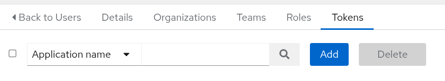

# AnsibleHound


## Overview

**AnsibleHound** is a BloodHound OpenGraph collector for **Ansible WorX** and **Ansible Tower**. The collector is designed to map the structure and permission of your organization into a navigable attack‑path graph.

Developped by [@Ramoreik](https://github.com/Ramoreik) and [@s_lck](https://github.com/s-lck).

## Collector Setup & Usage

### Building the tool

```bash
go build . -o build/collector
```

### Running the Collection

The collector can be run using any of the following authentication materials:

- `token` who is working only for local users
- `username/password` who is working for both local and LDAP users

The collector will then list the access permissions available to the user. The collection's results depend on the user's level of access used for collection.

> Note : If you have multiple instances of Ansible you need to run the collector against each of them

#### Token

To obtain a valid token for **Ansible WorX** or **Ansible Tower**, you can navigate to the **User Details** of your current user.


Then the **tokens** tab.



Finally, create a token and give it **Read** permissions.


To run the collector, provide it with a target and a token:

```bash
./collector -t '<ansible-url>' --token '<token>'

# Example
./collector -t 'http://localhost:8080/' --token '56KOmh...'
```

> Using local authentication will prevent you from connecting the Ansible and Active Directory graphs. In this way, the `SyncedToAHUser` edge will not appear.

#### Username/Password

To run the collector, provide it with a username and a password:

```bash
./collector -u '<username>' -p '<password>' -t '<ansible-url>'

# Example
./collector -u 'admin' -p 'tcrA...' -t 'http://10.10.10.10:8080'
```

> Provide the domain password for Active Directory / LDAP accounts.

> Using an Active Directory account will allow you to connect Ansible and Active Directory graphs through the `SyncedToAHUser` edge.

### Load Icons

A script is provided to import the icon for the custom nodes used by AnsibleHound.
You have to provide it the `bloodhound-url` and `jwt-token`.

```bash
python3 ./scripts/import-icons.py <bloodhound-url> <jwt-token>

# Example
python3 ./scripts/import-icons.py 'http://localhost:8080' 'ey[...]'
```

### Samples

If you don't have any Ansible WorX or Tower environment, you can just drop `./samples/example.json` on BHCE to enjoy the graph.

## Schema


### Nodes

Nodes correspond to each object type.

| Node              | Description                                                                                                           | Icon          | Color   |
| ----------------- | --------------------------------------------------------------------------------------------------------------------- | ------------- | ------- |
| ATAnsibleInstance | Complete installation of Ansible                                                                                      | sitemap       | #F59C36 |
| ATOrganization    | Logical collection of users, teams, projects, and inventories. It is the highest-level object in the object hierarchy | building      | #F59C36 |
| ATInventory       | Collection of hosts and groups                                                                                        | network-wired | #FF78F2 |
| ATGroup           | Group of hosts                                                                                                        | object-group  | #159b7c |
| ATUser            | An individual user account                                                                                            | user          | #7ADEE9 |
| ATJob             | Instance launching a playbook against an inventory of hosts                                                           | gears         | #7CAAFF |
| ATJobTemplate     | Combines an Ansible playbook from a project and the settings required to launch it                                    | code          | #493EB0 |
| ATProject         | Logical collection of Ansible playbooks                                                                               | folder-open   | #EC7589 |
| ATCredential      | Authenticate the user to launch playbooks (passwords - SSH keys) against inventory hosts                              | key           | #94E16A |
| ATCredentialType  | Type of the Credential and information about this type.                                                               | key           | #94E16A |
| ATHost            | These are the target devices (servers, network appliances or any computer) you aim to manage                          | desktop       | #E9E350 |
| ATTeam            | A group of users                                                                                                      | people-group  | #724752 |

### Edges

All the edges are prefixed by `AT` to make it distinct from other collectors edges.

Ansible edges only create relations between Ansible nodes:

| Edge Type    | Source              | Target                                                                                       |
| ------------ | ------------------- | -------------------------------------------------------------------------------------------- |
| `ATContains` | `ATAnsibleInstance` | `ATOrganization`                                                                             |
| `ATContains` | `ATOrganization`    | `ATInventory`                                                                                |
| `ATContains` | `ATInventory`       | `ATHost`                                                                                     |
| `ATContains` | `ATInventory`       | `ATGroup`                                                                                    |
| `ATContains` | `ATGroup`           | `ATHost`                                                                                     |
| `ATContains` | `ATJobTemplate`     | `ATJob`                                                                                      |
| `ATContains` | `ATOrganization`    | `ATJobTemplate`                                                                              |
| `ATContains` | `ATOrganization`    | `ATCredential`                                                                               |
| `ATContains` | `ATOrganization`    | `ATProject`                                                                                  |
| `ATUses`     | `ATJobTemplate`     | `ATProject`                                                                                  |
| `ATUses`     | `ATJobTemplate`     | `ATInventory`                                                                                |
| `ATUsesType` | `ATCredential`     | `ATCredentialType`                                                                            |
| `ATExecute`  | `ATUser`            | `ATJobTemplate`                                                                              |
| `ATExecute`  | `ATTeam`            | `ATJobTemplate`                                                                              |
| `ATMember`   | `ATUser`            | `ATOrganization` - `ATTeam`                                                                  |
| `ATRead`     | `ATUser`            | `ATOrganization` - `ATTeam` - `ATInventory` - `ATProject` - `ATJobTemplate`                  |
| `ATRead`     | `ATTeam`            | `ATOrganization` - `ATUser` - `ATInventory` - `ATProject` - `ATJobTemplate`                  |
| `ATAuditor`  | `ATUser`            | `ATOrganization` - `ATProject` - `ATInventory` - `ATJobTemplate`                             |
| `ATAdmin`    | `ATUser`            | `ATOrganization` - `ATTeam` - `ATInventory` - `ATProject` - `ATJobTemplate` - `ATCredential` |

Hybrid edges are forming connections between Ansible and other technologies:

| Edge Type        | Source              | Target     |
| ---------------- | ------------------- | ---------- |
| `SyncedToAHUser` | User                | ATUser     |

## Bugs

As AnsibleHound uses OpenGraph, which is only officially supported with Postgres as the backend, it is recommended to switch to Postgres to avoid ingestion bugs.

Documentation : <https://github.com/SpecterOps/BloodHound/tree/main/examples/docker-compose>

## Licensing

```
                    GNU GENERAL PUBLIC LICENSE
                       Version 3, 29 June 2007

 Copyright (C) 2007 Free Software Foundation, Inc. <https://fsf.org/>
 Everyone is permitted to copy and distribute verbatim copies
 of this license document, but changing it is not allowed.
```
